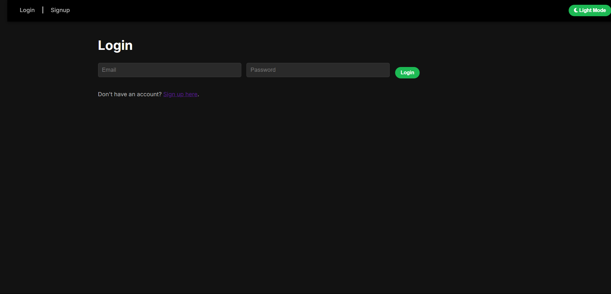
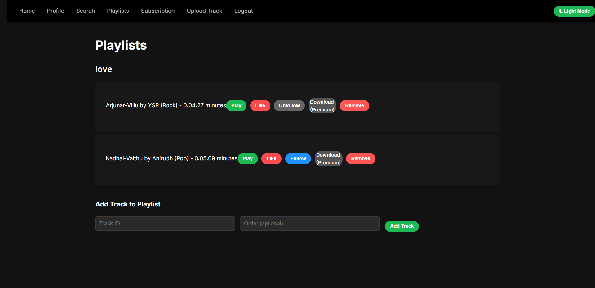
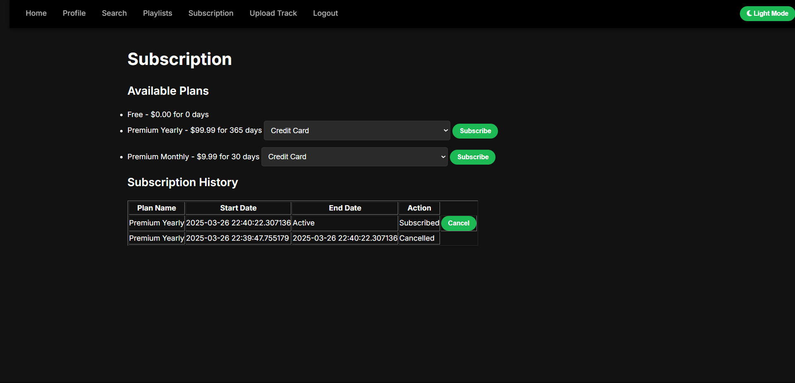

# 🎶 MusicHubX - Online Music Streaming Application

## 📌 Overview

**MusicHubX** is a full-stack web-based music streaming platform that enables users to sign up, log in, explore music, create and manage playlists, stream songs, and handle profiles and subscriptions. Built with a robust PostgreSQL database, Python (Flask), and a clean HTML/CSS frontend, it leverages stored procedures, functions, and triggers for seamless backend automation.

## ✨ Key Features

- 🎵 Stream `.mp3` songs directly from the web interface
- 📁 Create and manage personalized playlists
- 👤 User authentication and profile management
- 🔍 Search for music, artists, albums, and genres
- 💳 Subscription plans with payment simulation
- 📊 Admin dashboard for user and content management
- 📚 Extensive use of SQL stored procedures, functions, and triggers

## 🛠️ Tech Stack

- **Frontend**: HTML, CSS (Bootstrap)
- **Backend**: Python 3 (Flask Framework)
- **Database**: PostgreSQL with stored procedures, triggers, and functions
- **Tools**: pgAdmin, PyCharm

## 🧱 Database Design

The PostgreSQL schema consists of **15 tables**, including:
- `users`, `tracks`, `albums`, `artists`, `creates`
- `playlists`, `subscription_plan`, `subscription_history`, `payment`, `likes`
- `plays_queue`, `genre`, `follows`, `has_similarity`, `included_in`

### 🧠 Stored Procedures & Functions
- `add_album`, `add_track`, `cancel_subscription`
- `get_user_top_tracks`, `get_subscription_history`, `get_next_track`
- `process_payment`, `signup_user`, `search_music`, and more

### 🔄 Triggers
- `update_play_count`: Automatically updates the play count when a song is streamed.

## 🗂️ Project Structure
```
MusicHubX/
├── app.py                      # Flask application entry point
├── database/                   # SQL scripts for schema and queries
│   └── query.sql
├── templates/                  # HTML templates for the frontend
│   └── *.html
├── static/                     # CSS and static assets
│   └── style.css
├── songs/                      # MP3 files for playback
│   └── *.mp3
├── ScreenShots/                # UI screenshots
│   └── *.png
├── ER Diagram/                 # Entity-Relationship Diagram
│   └── MusicHubX ER Diagram.png
└── README.md                   # Project documentation
```
## ⚙️ Setup Instructions

### ✅ Prerequisites

- Python 3.x
- PostgreSQL (pgAdmin recommended)
- `pip` (Python package installer)

---

### 🚀 Steps to Run the Project

#### 1. **Clone the Repository**
```bash
git clone https://github.com/Parikshit-0210/MusicHubX.git
cd MusicHubX
```
#### 2. **Set Up the Database**
Open pgAdmin or any PostgreSQL client.

Create a new PostgreSQL database (e.g., musichubx).

Run the SQL script located at:

```bash
database/query.sql
This will create the tables, stored procedures, functions, and triggers.
```
#### 3. **Install Required Python Packages**
```bash
pip install -r requirements.txt
```
#### 4. **Run the Application**
```bash
python app.py
Open your browser and visit:
👉 http://localhost:5000
```
## 🖼️ Screenshots

### 🔐 Login Page  


### 🎉 Welcome Page  


### 🎧 Music Player  


### 📁 Playlist Management  


### 🔍 Search Functionality  


### 👤 Profile Section  


### 🛠️ Admin Dashboard  


### 💳 Subscription Page  


### 📌 ER Diagram  
A detailed Entity-Relationship Diagram is available for the database schema:


🚀 Future Enhancements
- Add real-time music streaming with cloud storage integration
- Implement recommendation algorithms based on user listening habits
- Enhance the UI with modern JavaScript frameworks (e.g., React or Vue.js)
- Add support for offline playback and mobile apps

✍️ Author
- Parikshit V
- Dhiyanesh B

📧 Email: parikshitvel0210@gmail.com

📝 License
- This project is licensed under the MIT License.
